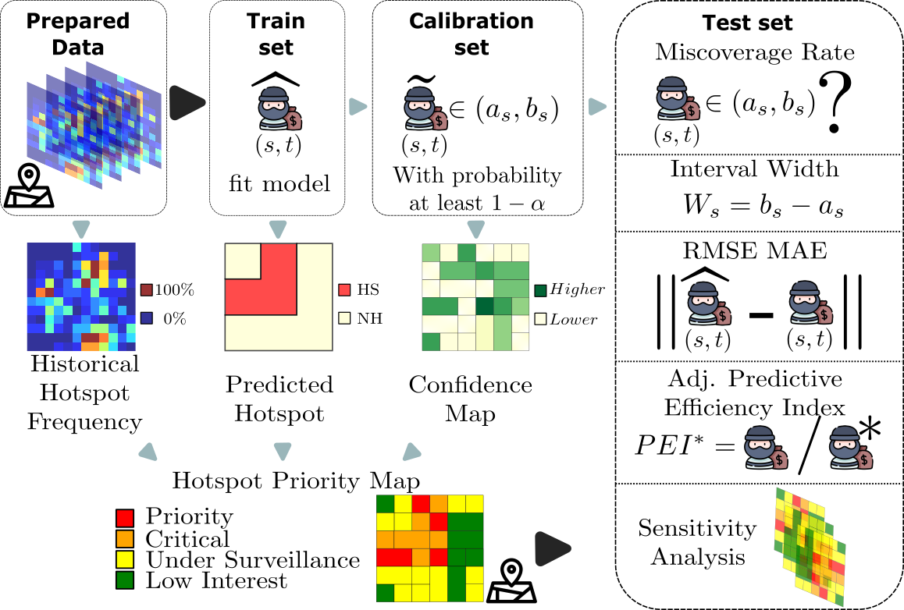
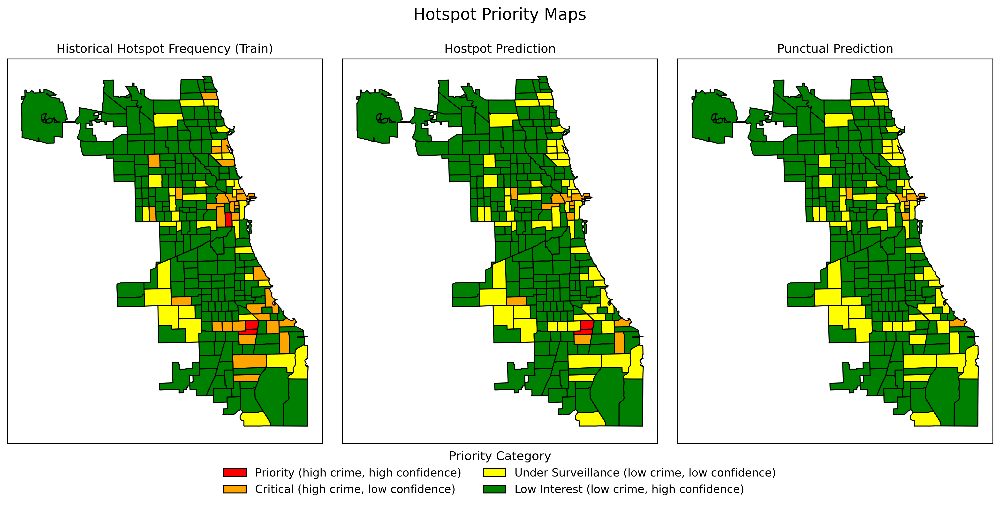
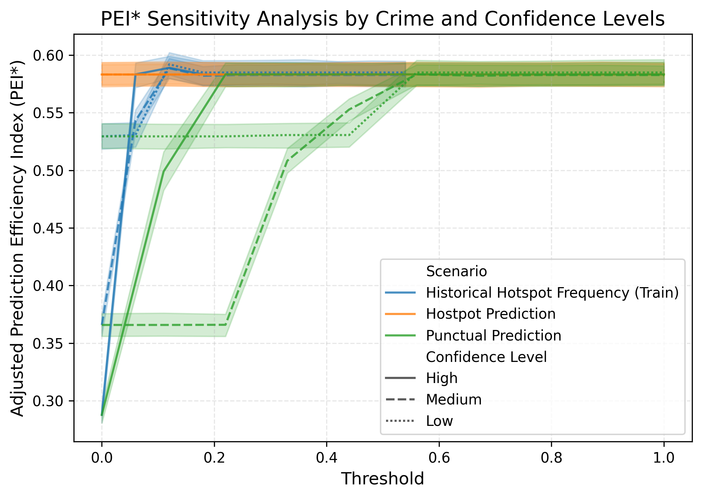
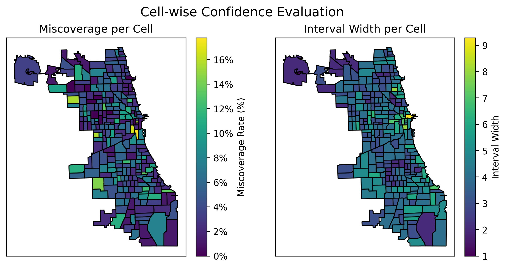
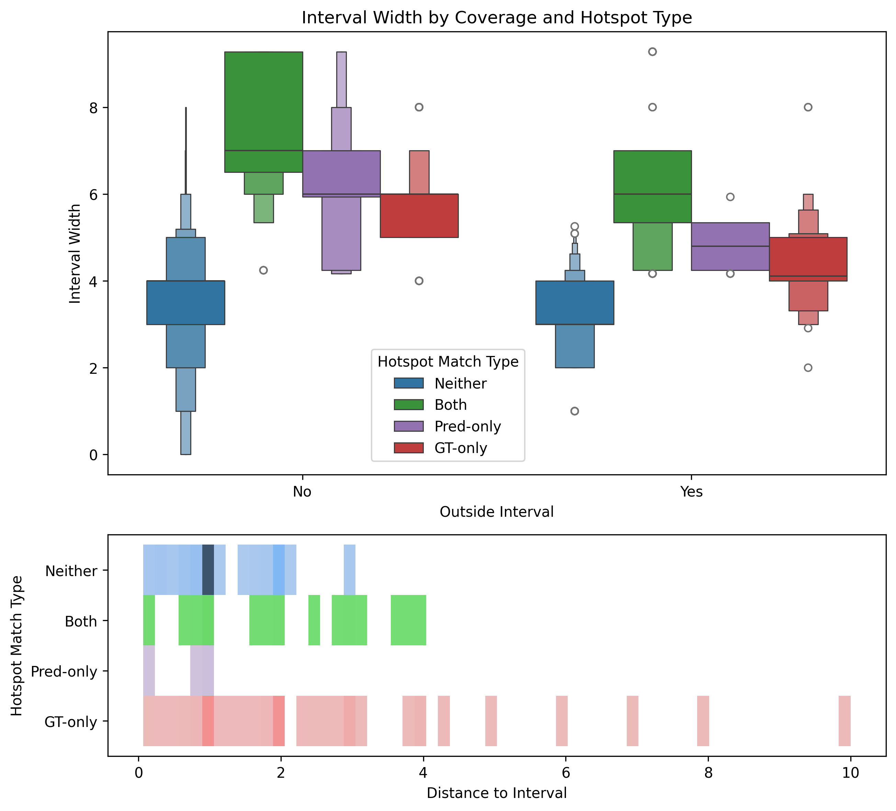
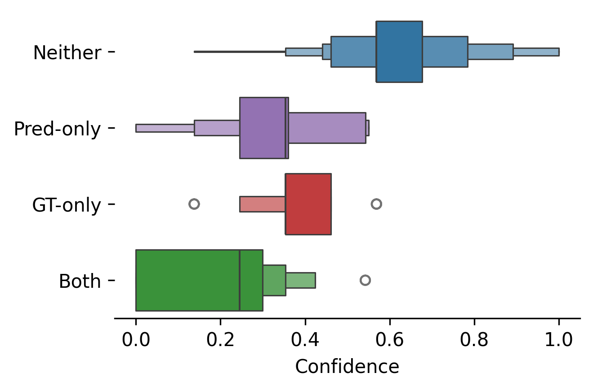
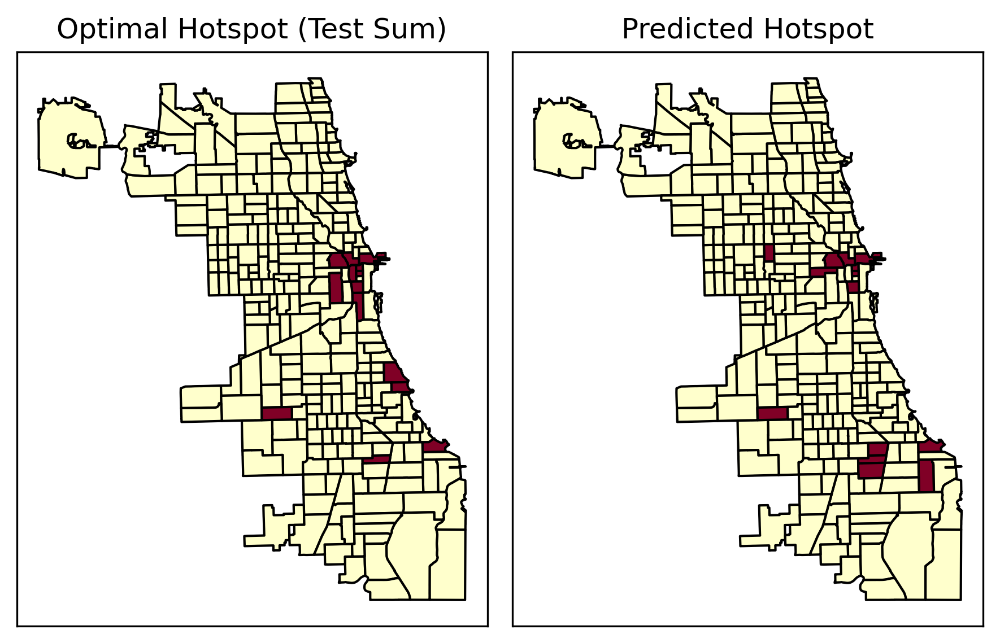
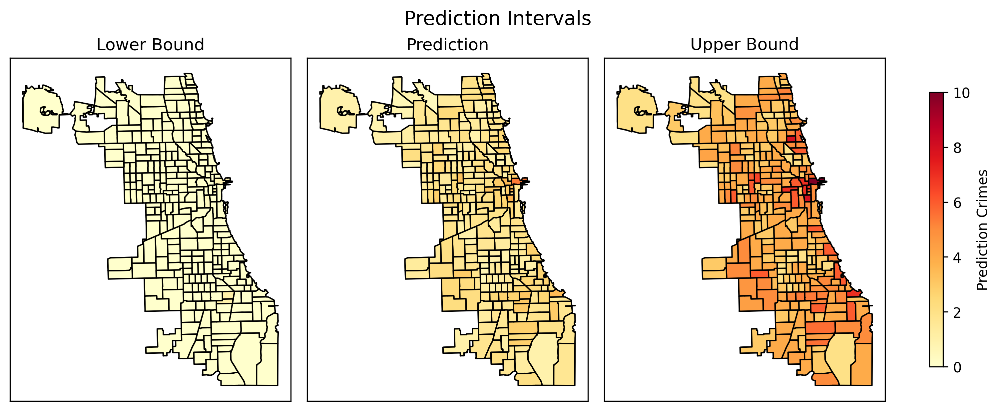

# Prioritizing Crime Hotspots with Conformal Prediction and Uncertainty Quantification

This work proposes a **model-agnostic framework** to classify crime hotspots by combining:
- 🔢 Point predictions from spatio-temporal models
- 📉 Prediction intervals via **Conformal Prediction (CP)**
- 📈 Crime indicators (historical frequency, binary predictions, and intensity)
- 🎯 Confidence scores derived from interval width.

Each spatial unit is assigned to one of four action categories:  
**Priority**, **Critical**, **Under Surveillance**, or **Low Interest**.


## 🔧 Method Pipeline


<p align="center">  </p>

> The framework starts with historical crime data, applies a simple forecast model, calibrates Conformal Prediction intervals, and classifies zones by combining confidence and crime indicators.

## 🗺️ Priority Maps
<p align="center">  </p>

## 📊 Sensitivity Analysis

<p align="center">  </p>

> Effect of varying thresholds for crime and confidence scores.  
> Higher confidence filters (solid lines) consistently improve prioritization performance (PEI*).

## 📉 Confidence and Miscoverage Metrics

| Metric Type | Visualization |
|-------------|---------------|
| **Miscoverage rate & Interval width** | <p align="center">  </p> |
| **Interval width vs. hotspot match** | <p align="center">  </p> |
| **Confidence by hotspot category** | <p align="center">  </p>  |

These plots reveal how uncertainty varies across space and hotspot classification types.

### 🎯 Hotspot Match Types:
| Label       | Description                                     |
|-------------|-------------------------------------------------|
| `Both`      | Cell is a hotspot in both prediction and truth. |
| `Pred-only` | Predicted as hotspot, but not in ground truth.  |
| `GT-only`   | Ground truth hotspot, but not predicted.        |
| `Neither`   | Not a hotspot in either.                        |

## 📍 Hotspot Comparison

<p align="center">  </p> 

> Static model predictions (right) vs. cumulative test-period hotspots (left).  
> While broad trends are captured, dynamic errors highlight the importance of uncertainty-aware methods.

## 🔽🟢🔼 Predictions Intervals
<p align="center">  </p> 
---

## 🔬 [Experiments Overview](experiments/chicago_real_data)

### 📁 [`01_preprocessing.ipynb`](experiments/chicago_real_data/01_preprocessing.ipynb)

- Loads and cleans the official 2024 Chicago crime dataset.
- Selects relevant crime types (e.g., `ASSAULT`, `ROBBERY`, `NARCOTICS`).
- Maps police zones to a 2D grid using a reproducible spatial mapping.
- Aggregates daily counts and exports a formatted dataset.


### 🧪 [`02_model_Real_chicago.ipynb`](experiments/chicago_real_data/02_Model_Real_Chicago.ipynb)

- Trains a naive per-cell model (mean count) on the Chicago dataset.
- Evaluates it on the test set using traditional spatio-temporal metrics:
  - RMSE, MAE, PAI, PEI, PEI*
- Produces baseline comparisons across different hotspot coverage levels.

### 📊 [`03_visualize_hotspots.ipynb`](experiments/chicago_real_data/03_visualize_hotspots)

- Visualizes daily and average predictions vs. ground truth.
- Highlights spatial variability in hotspot coverage.
- Saves prediction masks and hotspots for future comparison.

### 📐 [`04_uncertainty_analysis.ipynb`](experiments/chicago_real_data/04_uncertainty_analysis.ipynb)

- Applies **MAPIE** (Conformal Prediction) to the naive model.
- Computes per-cell prediction intervals.
- Measures and visualizes:
  - Interval width
  - Miscoverage rate
  - Confidence scores
- Introduces a **Hotspot Priority Map**:
  - Combines confidence and frequency into a **4-class taxonomy**.

| Category        | Frequency | Confidence | Color    |
|----------------|-----------|-------------|----------|
| 🟥 Priority     | High      | High        | Red      |
| 🟧 Critical     | High      | Low         | Orange   |
| 🟨 Under Surveillance   | Low       | Low         | Yellow   |
| 🟩 Low Interest | Low       | High        | Green    |

- Visualizes sensitivity to confidence and frequency thresholds.
- Stores intermediate results for further exploration.

### 🧪 [`05_evaluate_new_hotspots.ipynb`](experiments/chicago_real_data/05_evaluate_new_hotspots.ipynb)

- Compares baseline hotspot predictions with **new prioritized hotspots**.
- Computes PEI\* across multiple scenarios:
  - Ground truth historical frequency
  - Binary hotspot mask
  - Continuous predicted intensity
- Evaluates **sensitivity** of performance to thresholds in:
  - Confidence
  - Risk frequency
- Produces visual summaries of PEI* trends under various configurations.

## 📂 Repository Structure

```
uncertainty-hotspots
├── config.json                  # Global configuration
├── data/                        # Local processed datasets (real and synthetic)
│   └── real_data/Chicago/       # Preprocessed real crime data and metadata
│   └── examples/                # Single example dataset for quick reference
├── results/                     # Saved models, metrics, visualizations
├── notebooks/                   # Jupyter notebooks for each experiment
└── experiments/                 # Custom or extended experiments
```

> 🔎 **External Data** (not included): Real data is stored in  
> `../uncertainty-informed-data/real_data/Chicago/`.
> `../uncertainty-informed-data/simulations/poisson/`.


## 🧠 General Workflow Overview

### ⚙️ Configuration Setup

- Global parameters are defined in [`config.json`](config.json):
  - Grid size, partitions (train/calibration/test), hotspot definitions, etc.
  - Used consistently across synthetic and real-world pipelines.

## 📦 Key Modules ([src/](../../src/))

- `models/`: naive, poisson models per cell
- `evaluation/`: metrics for CP, PAI/PEI, temporal/spatial evaluation
- `conformal/`: wrapper for MAPIE and per-cell calibration
- `utils/`: preprocessing, grid transforms, plotting

## 🔍 Uncertainty-Aware Hotspot Prioritization

We define **spatio-temporal confidence** per cell:

```
Confidence(t,r,c) = 1 − NormalizedIntervalWidth(t,r,c)
```

This score enables **real-time prioritization**, even without future labels.

Using both **confidence** and **frequency**, cells are classified into four categories that support operational decision-making.

## 📈 Metrics

We evaluate:

- **Per-day RMSE/MAE** with std. deviation
- **PAI**, **PEI**, and **PEI*** with varying coverage thresholds
- **Miscoverage** and **Interval Width** per cell
- **Sensitivity to threshold values** in priority mapping


## 📖 References

- **MAPIE:** [https://github.com/scikit-learn-contrib/MAPIE](https://github.com/scikit-learn-contrib/MAPIE)  
- Shafer & Vovk (2008): ["A tutorial on conformal prediction"](https://www.jmlr.org/papers/v9/shafer08a.html)

---

## 🚧 Limitations and Future Work

- Assumes i.i.d. (CP requirement), doesn't model cascading events (e.g., SEPP).
- Hotspot allocation uses fixed percentage; dynamic patrol simulation is future work.
- Real data uses uniform grid over beats; no population normalization yet.

---

## ✅ Status

✔️ Full pipeline implemented for real data  
✔️ Modular structure, reproducible experiments  
✔️ Integration of conformal prediction and risk-based prioritization  
⬜ Integration with additional ML models  
⬜ Longitudinal drift evaluation